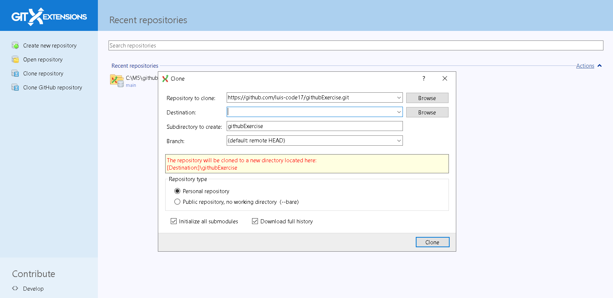

### INSTALAR GIT EXTETENSION 
Lo primer que hay que hacer es descargar la extension, sencillamente entramos al link lo descarga seguimos los pasos que indique y si hace falta algun herrmaienta mas lo descargamos en mi caso fue un archivo .net.
### CLONAR EL REPOSITORY
A la izquierda tenemos la opcion de clonar el repository clickamos i nos sale la siguiente pestaña en la cual solo tenemos que colocar el url del repository y donde lo queremos guardar
